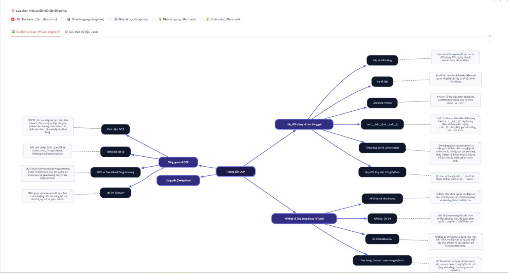
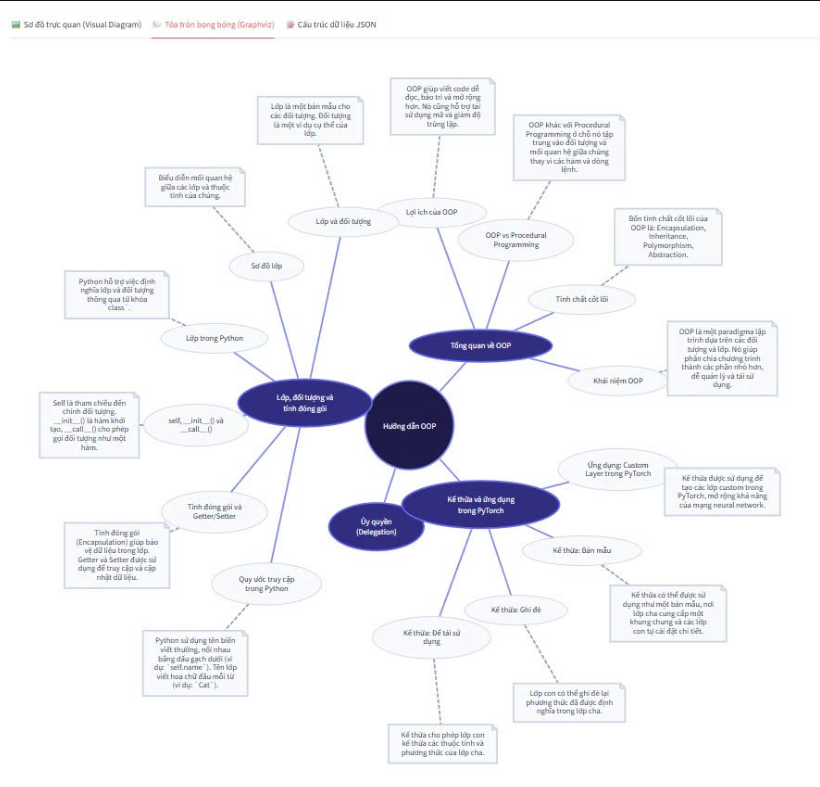

# 📚 PDF RAG Chatbot with Streamlit

Dự án **PDF RAG Chatbot** là một ứng dụng hỏi đáp thông minh dựa trên nội dung tài liệu PDF do người dùng tải lên. Ứng dụng sử dụng kỹ thuật **RAG (Retrieval-Augmented Generation)** để trích xuất ngữ cảnh chính xác từ tài liệu và trả lời câu hỏi.

Ứng dụng hỗ trợ cơ chế chạy song song và dự phòng linh hoạt:
- **Chạy cục bộ (Local)**: Sử dụng Ollama.
- **Chạy trên đám mây (Cloud)**: Tự động chuyển hướng sang Google Gemini API khi máy cục bộ chưa bật Ollama hoặc thiếu mô hình.

---

## 🛠️ Công nghệ sử dụng

1. **Frontend & App Framework**: [Streamlit](https://streamlit.io/) (Python)
2. **Vector Database**: [ChromaDB](https://www.trychroma.com/) (Chạy **In-memory** tạm thời trong bộ nhớ RAM, tự động dọn dẹp khi tải tài liệu mới)
3. **Local Engine (Mặc định)**:
   - Mô hình nhúng (Embedding): `bge-m3` (chạy qua Ollama)
   - Mô hình ngôn ngữ (LLM): `vicuna:7b-v1.5-q5_1` (chạy qua Ollama)
4. **Cloud Fallback (Dự phòng)**:
   - Mô hình nhúng (Embedding): `gemini-embedding-001` (chạy qua Google GenAI API)
   - Mô hình ngôn ngữ (LLM): `gemini-3.5-flash` (chạy qua Google GenAI API)
5. **Trích xuất PDF**: `pypdf`
6. **Vẽ sơ đồ tư duy**: [Graphviz](https://graphviz.org/) (Tích hợp trực tiếp qua Streamlit, tự động co giãn vừa màn hình, không lỗi cú pháp)

---

## 📂 Cấu trúc thư mục dự án

```text
rag_chatbot_pdf/
├── app.py                     # Điểm chạy chính (Main Entrypoint)
├── .env                       # File cấu hình khóa bảo mật (API Key) - Đã được thêm vào .gitignore
├── .env.example               # File mẫu cấu hình
├── app/                       # Thư mục chứa mã nguồn chính
│   ├── config.py              # Cấu hình Model, Prompt
│   ├── auth/                  # Quản lý xác thực người dùng
│   │   └── service.py
│   ├── core/                  # Core RAG và Database (Cấu trúc OOP)
│   │   ├── database.py        # Lớp ChromaDatabaseManager (Singleton)
│   │   └── rag.py             # Lớp AIService (Singleton)
│   ├── services/              # Xử lý nghiệp vụ PDF
│   │   └── pdf_service.py     # Lớp PDFProcessor (OOP)
│   └── ui/                    # Các màn hình giao diện (Streamlit Views)
│       ├── chat_view.py       # Màn hình hỏi đáp chính
│       └── login_view.py      # Màn hình đăng nhập
├── requirements.txt           # Danh sách thư viện phụ thuộc
└── README.md                  # Hướng dẫn dự án
```

---

## 🚀 Hướng dẫn cài đặt & Chạy ứng dụng

### 1. Yêu cầu hệ thống
- Máy tính đã cài đặt **Python 3.9+**.
- *(Tùy chọn)* Nếu muốn chạy offline cục bộ: Đã cài đặt **Ollama** và tải về các mô hình tương ứng:
  ```bash
  # Tải mô hình Embedding
  ollama pull bge-m3
  
  # Tải mô hình LLM
  ollama pull vicuna:7b-v1.5-q5_1
  ```

### 2. Thiết lập môi trường ảo và cài đặt thư viện
Tại thư mục gốc của dự án, mở terminal và chạy:

```bash
# Tạo môi trường ảo
python3 -m venv .venv

# Kích hoạt môi trường ảo
# Trên macOS / Linux:
source .venv/bin/activate
# Trên Windows:
# .venv\Scripts\activate

# Cài đặt các thư viện cần thiết (bao gồm google-genai và python-dotenv)
pip install -r requirements.txt
```

### 3. Cấu hình biến môi trường (Cho Gemini)
Nếu không chạy Ollama cục bộ, ứng dụng sẽ yêu cầu cấu hình Gemini API Key:
1. Nhân bản file cấu hình mẫu:
   ```bash
   cp .env.example .env
   ```
2. Mở file `.env` và nhập khóa API của bạn:
   ```env
   GEMINI_API_KEY=khóa_api_gemini_của_bạn
   ```
   *(Lấy key tại [Google AI Studio](https://aistudio.google.com/))*

### 4. Khởi chạy ứng dụng
Chạy ứng dụng bằng lệnh sau:
```bash
streamlit run app.py
```

Ứng dụng sẽ tự động mở trên trình duyệt tại địa chỉ mặc định: `http://localhost:8501`.

---

## 🔐 Tài khoản đăng nhập demo

Sau khi khởi chạy, màn hình đăng nhập (Login View) sẽ hiển thị. Bạn có thể sử dụng tài khoản mặc định sau để truy cập:

- **Tên đăng nhập:** `admin`
- **Mật khẩu:** `admin123`

---

## 💡 Các tính năng nổi bật

- **Tái cấu trúc hướng đối tượng (OOP)**: Toàn bộ lõi ứng dụng được viết bằng các lớp đối tượng chuyên biệt (`ChromaDatabaseManager`, `AIService`, `PDFProcessor`) kết hợp cùng Singleton Pattern để tối ưu tài nguyên và dễ mở rộng.
- **Lưu trữ Vector In-Memory**: Vector chỉ được lưu tạm thời trong RAM (không lưu xuống ổ cứng). Mỗi lần người dùng tải lên tài liệu mới, hệ thống tự động dọn dẹp các tài liệu cũ để đảm bảo **chỉ hỏi đáp thông tin của tài liệu hiện tại**.
- **Cơ chế dự phòng thông minh (Gemini Fallback)**: Tự động chuyển đổi mượt mà sang Gemini API nếu phát hiện Ollama offline hoặc thiếu mô hình.
- **Xử lý trượt & Giới hạn tần suất gọi API (Rate Limit / Overloaded)**: Trích xuất embedding bằng Gemini theo từng batch nhỏ (tối đa 20 văn bản/lần) đi kèm cơ chế tự động nghỉ (sleep) và thử lại có thời gian giãn cách tăng dần (Exponential Backoff) để xử lý lỗi 429/503.
- **Tránh lỗi Dimension Mismatch**: Lưu trữ thông tin loại mô hình nhúng (`ollama` hoặc `gemini`) vào metadata của từng tài liệu. Ngăn chặn việc truy vấn chéo sai chiều không gian vector.
- **Xuất Sơ đồ tư duy đa dạng (Mindmap)**: Tự động trích xuất nội dung cốt lõi của tài liệu để vẽ sơ đồ tư duy trực quan bằng **Graphviz** với 4 kiểu định dạng hiển thị: Tỏa tròn hai bên từ tâm, Nhánh ngang, Nhánh dọc và Tab chuyên biệt Tỏa tròn bong bóng (`twopi`), hỗ trợ tự động co giãn vừa vặn màn hình và tích hợp sẵn nút ghi chú chi tiết nét đứt.
- **Giao diện Glassmorphism**: Thiết kế bắt mắt, phông chữ Outfit sang trọng và hiệu ứng chuyển đổi mượt mà.

---

## 📷 Hình ảnh minh họa sơ đồ tư duy

Dưới đây là hình ảnh thực tế các dạng sơ đồ tư duy được tạo tự động từ tài liệu PDF:

### 1. Sơ đồ trực quan tỏa hai bên (Visual Diagram)


### 2. Sơ đồ tỏa tròn bong bóng (Circular Diagram)

